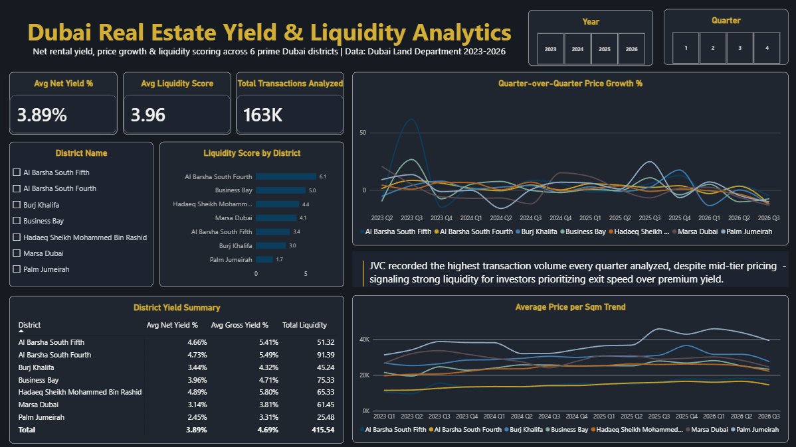

# Dubai Real Estate Yield & Liquidity Analytics

SQL + Power BI analysis evaluating net rental yield, price appreciation, and transaction liquidity across 6 prime Dubai residential submarkets using authentic Dubai Land Department (DLD) transaction records (163,000+ transactions, 2023–2026).

---

## 📊 Dashboard Preview

---

## 💡 Key Finding

**Jumeirah Village Circle (JVC)** consistently recorded the highest quarterly transaction volume throughout the analyzed period despite mid-tier unit pricing. This demonstrates exceptional market liquidity for investors prioritizing exit speed over peak gross rental yields.

---

## 📖 Case Study & Methodology

For a complete breakdown of data cleaning steps, MySQL queries, DAX yield formulas, and analytical trade-offs, read the full case study:

👉 **[Read Full Case Study (case_study.md)](case_study.md)**

---

## 🛠️ Tech Stack

* **Database & Transformation:** MySQL (CTEs, Window Functions, Aggregations)
* **Data Processing:** Python (pandas, SQLAlchemy)
* **Visualization:** Power BI Desktop (DAX, Custom Dark Theme)
* **Version Control:** Git & GitHub

---

## 📁 Repository Structure

* `data/clean/`: Benchmark datasets and lightweight sample data.
* `notebooks/`: Python notebooks for data merging and inspection.
* `sql/`: Production SQL scripts for yield and liquidity calculations.
* `case_study.md`: Detailed analytical narrative and project breakdown.